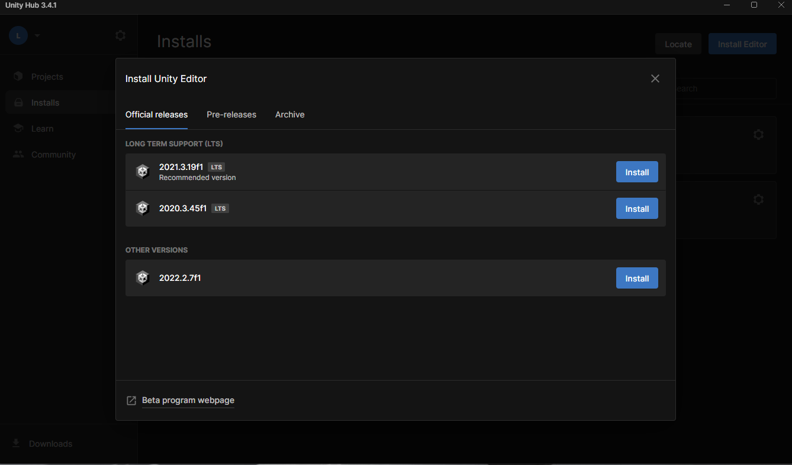
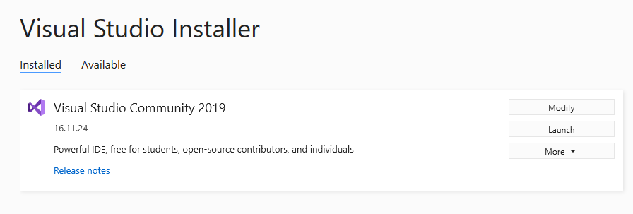
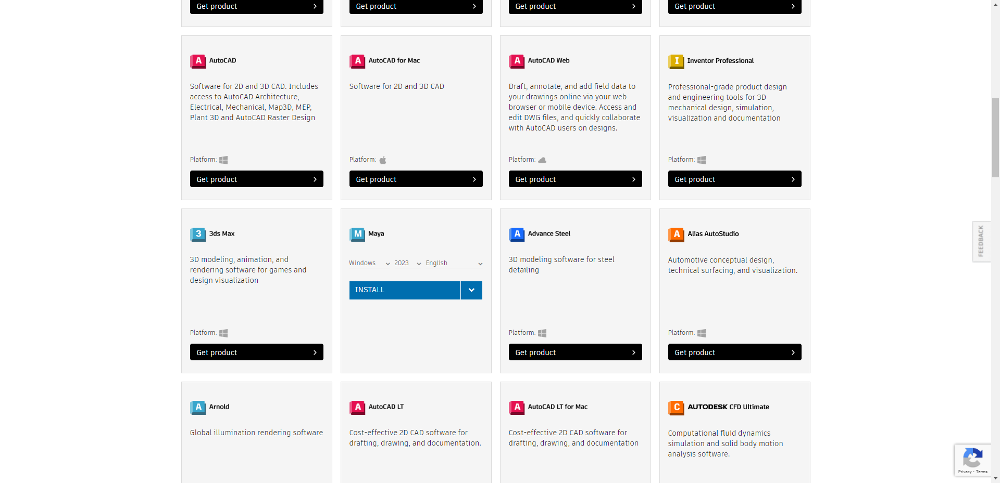

# Developer Manual

This manual is used for the developer to setup the project on local environment.

Install needed tools 

#### Install Unity 

**Platform**: MS-Windows

1. Register one unity id account https://id.unity.com/en

2. Install Unity Download the unity hub from this link: https://unity.com/download , Follow the instructions onscreen for guidance through the installation process and setup.

3. login the Unity-Hub with your account and Install the Unity-Editor: 

#### Install Visual Studio Community 2019 

Download link: https://www.techspot.com/downloads/7241-visual-studio-2019.html

Install Auto-Desk MAYA 

Create an Auto-Desk account [as student or instructor with the NUS school email so you can use it for 1 year free] with the url: https://www.autodesk.com/products/maya/overview?term=1-YEAR&tab=subscription

Login Auto-Desk and download MAYA from Auto-Desk Store: https://www.autodesk.com/products/maya/trial-intake

Download 

https://krita.org/en/download/krita-desktop/

