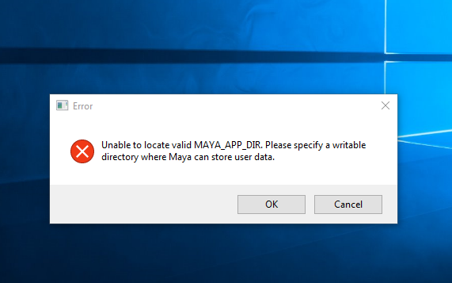
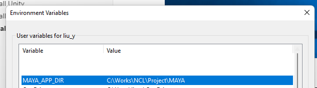
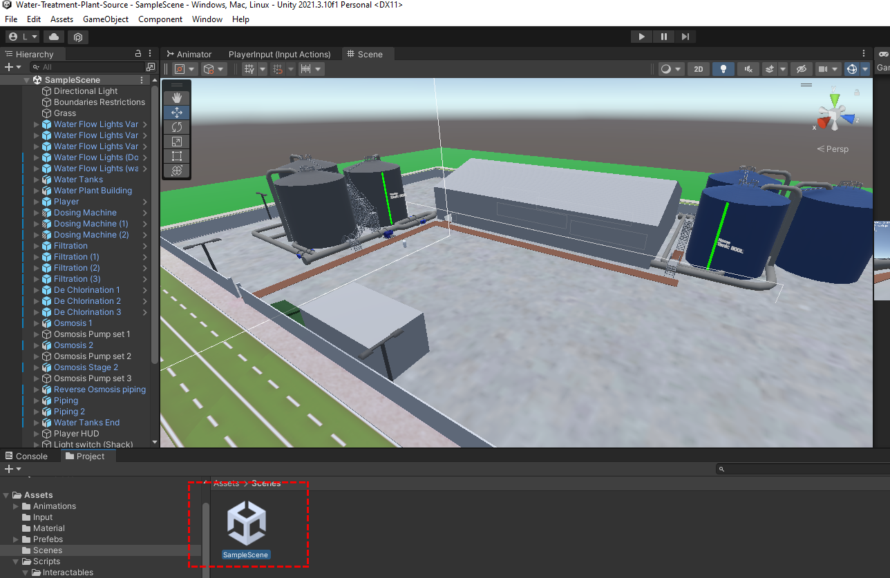

# Developer Manual

This manual is used for the developer to setup the unity-3D water treatment plant project on their local environment.

[TOC]

- [Developer Manual](#developer-manual)
    + [Install needed tools/IDE](#install-needed-tools-ide)
      - [Install Unity](#install-unity)
      - [Install Visual Studio Community 2019](#install-visual-studio-community-2019)
      - [Install Auto-Desk MAYA](#install-auto-desk-maya)
      - [Install Krita Editor](#install-krita-editor)
    + [Setup Unity Project](#setup-unity-project)

------

### Install needed tools/IDE 

Four tools are used in this project, Unity is used to edit the project, MAYA is used to build and edit the 3D modules in the project, Visual Studio is used to edit the C# code. And Krita is used to edit the picture and module surface texture. Unity, MAYA Visual Studio are necessary and Krita is optional.

#### Install Unity 

**Platform**: MS-Windows

1. Register one unity id on unity official web: https://id.unity.com/en

2. Download the **Unity Hub** from this link: https://unity.com/download , follow the instructions onscreen for guidance through the installation process and setup.

3. login the Unity-Hub with your account and Install the Unity-Editor: 

#### Install Visual Studio Community 2019 

**Platform**: MS-Windows

1. Download link: https://www.techspot.com/downloads/7241-visual-studio-2019.html
2. login a valid MS account (hotmail/SoC account) then install:

#### Install Auto-Desk MAYA 

1. Create an Auto-Desk account [as *student* or *instructor* with the NUS school email so you can use it for 1 year free] with the url: https://www.autodesk.com/products/maya/overview?term=1-YEAR&tab=subscription

2. Login Auto-Desk and download MAYA from Auto-Desk Store: https://www.autodesk.com/products/maya/trial-intake

3. After install the Autodesk Desktop App and Maya 2023, run the Maya 2023. if a error "Unable to allocate MAYA_APP_DIR..." error dialog pop-up: 

    

   Setup the windows system path by "Change advanced system setting" => "System properties" => "Environment Variables" => Add the MAYA path in PATH

   

Reference: https://www.youtube.com/watch?v=g2pFVBvfCJI

#### Install Krita Editor

Register a account and download Krita Editor from url: https://krita.org/en/download/krita-desktop/

### Setup Unity Project

Download the project unity project from this link: 

https://drive.google.com/file/d/1lo-4KABsTWaG-jWXSd6HI8IfhLWE0y_P/view?usp=sharing

Open the project with Unity Editor,select Assess => Scenes => SampleScene, then you can edit the project module as shown below:

 

------

> Last edit by LiuYuancheng(liu_yuan_cheng@hotmail.com) at 23/02/2023, if you have any problem or find anu bug, please send me a message .